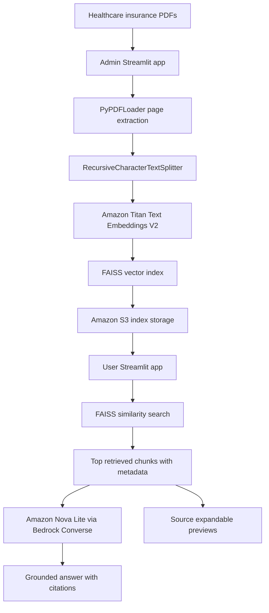
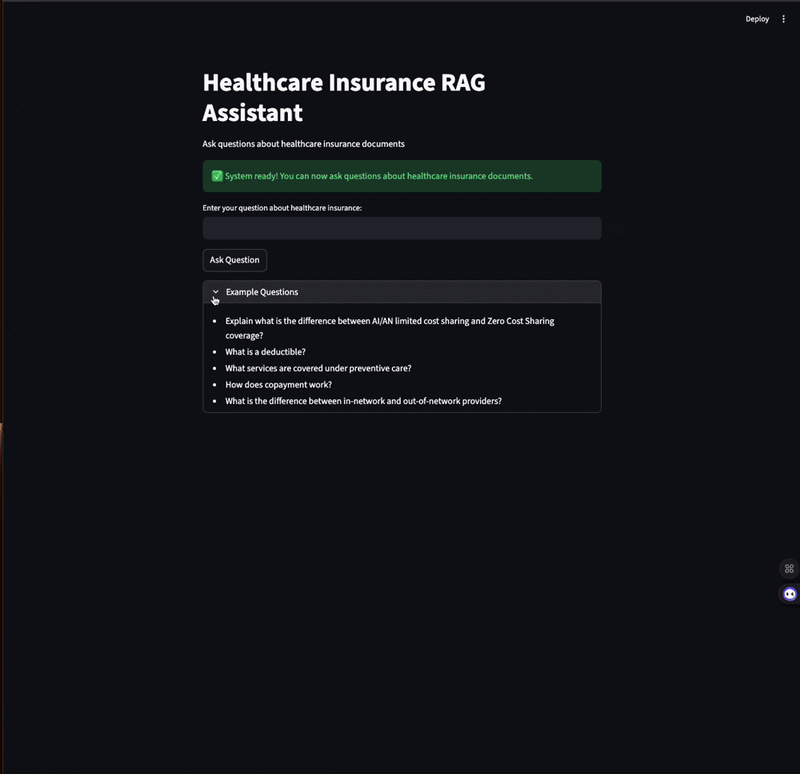

# Healthcare RAG Bot

Healthcare RAG Bot is a retrieval-augmented generation system for healthcare insurance documents. It turns policy PDFs, benefit summaries, glossaries, and marketplace methodology documents into searchable FAISS indexes, stores those indexes in Amazon S3, and lets users ask grounded natural-language questions through a Streamlit interface powered by Amazon Bedrock.

The project is designed as an informational assistant for healthcare insurance documents. It does not provide medical, legal, or financial advice. The assistant answers only from retrieved document context and shows source references so users can trace claims back to the original PDFs.

## Problem Statement

Healthcare insurance documents are long, technical, and often written for compliance rather than day-to-day decision making. Important details such as deductibles, cost sharing, covered services, plan terminology, or marketplace methodology can be spread across multiple PDFs.

This project addresses that challenge by creating a RAG workflow that can:

- Ingest healthcare insurance PDFs into vector-searchable document chunks.
- Preserve source metadata such as filename and page number.
- Store generated FAISS vector indexes in S3 for reuse.
- Let admins process either one PDF or a full directory of PDFs.
- Let users ask questions against the indexed documents.
- Generate concise answers with inline source references such as `[S1]` and `[S2]`.
- Show the source document and content preview behind each cited chunk.
- Verify that chunk references map back to the correct documents and pages.

## Project Architecture



## Demo Views

Data query interface:



Batch processing interface:


## Repository Structure

```text
Healthcare-RAG-Bot/
|-- README.md
|-- main.py
|-- run_tests.py
|-- run_tests.sh
|-- Admin/
|   |-- admin.py
|   |-- config.py
|   |-- s3_operations.py
|   |-- pdf_processor.py
|   |-- bulk_processor.py
|   |-- ui_components.py
|   |-- compatibility.py
|   |-- requirements.txt
|   |-- Dockerfile
|   |-- README.md
|-- User/
|   |-- app.py
|   |-- app_enhanced.py
|-- tests/
|   |-- test_complete_system.py
|   |-- test_s3_connection.py
|   |-- test_bedrock_simple.py
|   |-- test_nova_converse.py
|   |-- test_bulk_processing.py
|   |-- test_user_interface.py
|   |-- test_embedding_regions.py
|   |-- test_admin_embedding.py
|   |-- test_boto3.py
|   |-- README.md
|-- pdf-sources/
|   |-- healthcare insurance sample and methodology PDFs
|-- CHUNK_VERIFICATION_REPORT.md
|-- fix_chunk_references.py
|-- test_chunk_verification.py
|-- test_enhanced_interface.py
|-- DataQuery.gif
|-- BatchProcessing.gif
```

## Document Corpus

The repository includes a sample healthcare insurance corpus under `pdf-sources/`. These documents are used to build and test the retrieval pipeline.

| Corpus Detail | Value |
| --- | ---: |
| Included PDF files | 10 |
| Chunk size | 1,000 characters |
| Chunk overlap | 200 characters |
| Retrieval count in user app | Top 3 chunks |
| Vector index format | FAISS `.faiss` + `.pkl` |
| Index storage | Amazon S3 |

Included source files cover:

- Uniform glossary of coverage and medical terms.
- AI/AN limited cost sharing and zero cost sharing documents.
- Summary of Benefits and Coverage sample documents.
- Essential health benefits and COVID-19 benchmark coverage.
- Qualified Health Plan premium choice reports and methodology.
- State-based marketplace issuer enrollment methodology.

## Core Methodology

### 1. Configuration and AWS Setup

The admin module centralizes configuration in `Admin/config.py`.

Key settings:

| Setting | Value |
| --- | --- |
| Embedding model | `amazon.titan-embed-text-v2:0` |
| Generation model | `us.amazon.nova-lite-v1:0` |
| Chunk size | `1000` |
| Chunk overlap | `200` |
| AWS services | Bedrock Runtime, S3 |
| Required environment variables | `AWS_ACCESS_KEY_ID`, `AWS_SECRET_ACCESS_KEY`, `AWS_DEFAULT_REGION`, `BUCKET_NAME` |

AWS clients are lazily initialized so S3, Bedrock runtime, and Bedrock embeddings are only created when needed.

### 2. PDF Processing

`Admin/pdf_processor.py` handles the transformation from raw PDF to vector store.

The processing flow:

1. Read a PDF with `PyPDFLoader`.
2. Split extracted text with `RecursiveCharacterTextSplitter`.
3. Add `original_filename` metadata to every chunk.
4. Embed chunks with Amazon Titan Text Embeddings V2.
5. Build a FAISS vector store from embedded chunks.
6. Save temporary FAISS artifacts under `/tmp/`.
7. Upload `.faiss` and `.pkl` files to S3.
8. Remove temporary local index files.
9. Return processing status, page count, chunk count, and S3 keys.

Each document is stored using a cleaned filename prefix. For example, a PDF named `AIAN-Zero-Cost-Sharing 060723_0.pdf` is converted into a stable S3 key prefix and produces matching `.faiss` and `.pkl` files.

### 3. Duplicate Detection

`Admin/s3_operations.py` checks whether both index artifacts already exist for a document:

- `<document_prefix>.faiss`
- `<document_prefix>.pkl`

If both files exist and `skip_existing=True`, the processor skips that PDF instead of re-embedding it. This saves Bedrock cost, reduces processing time, and prevents accidental overwrites.

### 4. Bulk Processing

`Admin/bulk_processor.py` scans the `pdf-sources/` folder and processes every PDF it finds.

The bulk workflow provides:

- PDF discovery from the project-level `pdf-sources` directory.
- Optional duplicate skipping through S3 checks.
- Streamlit progress bar.
- Real-time processing log.
- Per-file status tracking.
- Summary metrics for processed, skipped, and failed files.
- Detailed result tabs for all files, skipped files, and newly processed files.

This makes the admin interface useful for both initial corpus setup and repeated updates.

### 5. User Querying

The user app loads FAISS vector stores from S3 and performs similarity search over indexed chunks.

Query flow:

1. User asks a healthcare insurance question.
2. The app loads the selected FAISS index from S3.
3. The question is embedded with the same Bedrock embedding model used during ingestion.
4. FAISS returns the top 3 most similar chunks.
5. Retrieved chunks are formatted as numbered sections: `[S1]`, `[S2]`, `[S3]`.
6. Amazon Nova Lite receives the question plus retrieved context.
7. The prompt instructs the model to answer only from context and cite section IDs.
8. The UI shows the answer and expandable source previews.

The enhanced app, `User/app_enhanced.py`, adds document selection. Users can query a single document-specific vector store or the combined legacy `my_faiss` index.

## Prompting and Grounding Strategy

The answer-generation prompt is intentionally restrictive. It tells Nova Lite to:

- Use only the provided context sections.
- Say it does not know when the answer is not present.
- Include citations such as `[S1]` and `[S2]`.
- Avoid speculation or fabricated policy details.
- Avoid medical, legal, or financial advice.
- Keep answers concise and neutral.
- Prefer bullet lists for multi-part answers.

This prompt design is important because healthcare insurance content can be high-impact and terminology-heavy. The assistant is meant to make documents easier to understand, not replace plan documents or professional review.

## Source Attribution

Source attribution is implemented at the chunk level.

Each retrieved chunk includes:

- Section ID such as `[S1]`.
- Original filename when available.
- Page number when available.
- Short content preview.
- Full reference in the UI expander.

Example output pattern:

```text
A deductible is the amount owed for covered healthcare services before the plan begins to pay [S1].

Sources:
- [S1]: 183058_uniform-glossary-final.pdf, page 0
- [S2]: 183058_uniform-glossary-final.pdf, page 3
```

This lets a user inspect why the answer was produced and where the supporting language came from.

## Validation and Testing

The repository includes a dedicated test suite under `tests/` plus additional chunk-reference verification scripts.

| Test Area | Files |
| --- | --- |
| AWS connectivity | `test_s3_connection.py`, `test_boto3.py` |
| Bedrock model access | `test_bedrock_simple.py`, `test_nova_converse.py` |
| Embedding setup | `test_embedding_regions.py`, `test_admin_embedding.py` |
| Admin processing | `test_bulk_processing.py` |
| User app setup | `test_user_interface.py` |
| End-to-end workflow | `test_complete_system.py` |
| Chunk reference behavior | `test_chunk_verification.py`, `test_enhanced_interface.py` |

Run all tests:

```bash
./run_tests.sh
```

Or:

```bash
python3 run_tests.py
```

Run individual tests:

```bash
python3 tests/test_s3_connection.py
python3 tests/test_bedrock_simple.py
python3 tests/test_bulk_processing.py
```

## Chunk Reference Verification

`CHUNK_VERIFICATION_REPORT.md` documents verification of the `[S1]`, `[S2]`, `[S3]` citation system.

Verified behavior includes:

- Chunk references are generated sequentially.
- Retrieved chunks contain content from the expected source documents.
- Original filename and page metadata are preserved.
- Source previews map back to the displayed citation IDs.
- The enhanced user interface resolves the earlier limitation where the original app was hardcoded to the legacy combined `my_faiss` store.

The report identifies `User/app_enhanced.py` as the preferred user interface because it supports document selection and clearer attribution.

## Running the Project

### 1. Clone the Repository

```bash
git clone https://github.com/Johnny001-DS/Healthcare-RAG-Bot.git
cd Healthcare-RAG-Bot
```

### 2. Create a Python Environment

```bash
python3 -m venv venv
source venv/bin/activate
```

On Windows:

```bash
venv\Scripts\activate
```

### 3. Install Dependencies

```bash
pip install -r Admin/requirements.txt
```

### 4. Configure Environment Variables

Create a `.env` file in the project root:

```env
AWS_ACCESS_KEY_ID=your_access_key
AWS_SECRET_ACCESS_KEY=your_secret_key
AWS_DEFAULT_REGION=us-east-2
BUCKET_NAME=your_s3_bucket_name
```

### 5. Enable Bedrock Models

In the Amazon Bedrock console, request access to:

- Amazon Titan Text Embeddings V2
- Amazon Nova Lite

The user app calls Nova Lite through the Bedrock Converse API with the model ID `us.amazon.nova-lite-v1:0`.

### 6. Process Documents

Start the admin app:

```bash
streamlit run Admin/admin.py --server.port 8501
```

Open:

```text
http://localhost:8501
```

Use the admin UI to process one PDF or run bulk processing over `pdf-sources/`.

### 7. Ask Questions

Start the enhanced user app:

```bash
streamlit run User/app_enhanced.py --server.port 8502
```

Open:

```text
http://localhost:8502
```

Select a document or the combined index, then ask questions such as:

- What is a deductible?
- What is the difference between AI/AN limited cost sharing and zero cost sharing?
- What are essential health benefits?
- What services are covered under preventive care?
- How does a copayment work?
- What is the difference between in-network and out-of-network providers?

## Key Results

- The admin module has been refactored into focused modules for configuration, S3 operations, PDF processing, bulk orchestration, and UI components.
- The system supports both single-file and bulk PDF processing.
- FAISS indexes are stored as reusable S3 artifacts.
- The enhanced user app supports document-specific querying.
- Chunk references have been verified to map correctly to source documents and pages.
- The test suite covers AWS setup, Bedrock access, embeddings, admin processing, user interface setup, and end-to-end behavior.

## Design Tradeoffs

| Decision | Benefit | Tradeoff |
| --- | --- | --- |
| FAISS stored in S3 | Simple, portable vector indexes | Loading indexes from S3 is less dynamic than a managed vector database |
| One vector store per processed PDF | Clear document-specific querying | Cross-document search requires a combined index |
| Streamlit admin and user apps | Fast development and easy demos | Not a hardened multi-user production frontend |
| Bedrock Titan + Nova | AWS-native model stack | Requires Bedrock model access and region support |
| Local temp files during processing | Simple FAISS artifact creation | Needs cleanup and suitable runtime filesystem access |

## Limitations

- The app assumes AWS credentials and Bedrock access are already configured.
- The original `User/app.py` is limited to the legacy `my_faiss` combined index; `User/app_enhanced.py` is the stronger interface.
- Retrieval uses a fixed top-3 setting in the user app.
- FAISS indexes are loaded from S3 at query time, which may not be optimal for high-traffic production use.
- The system is not a substitute for plan documents, licensed medical guidance, legal guidance, or financial advice.

## Future Improvements

- Promote `User/app_enhanced.py` as the default user entry point.
- Add a managed vector database option for multi-document search at scale.
- Add query analytics for unanswered questions and low-confidence retrieval.
- Add document summaries and metadata previews to the document selector.
- Add configurable retrieval count and score thresholds in the user UI.
- Add automated evaluation against a curated question-answer set.
- Add authentication and role-based access for admin and user apps.
- Add a deployment guide for AWS App Runner, ECS, or Streamlit Community Cloud.
- Add CI checks for tests and formatting.

## Author

Karan Badlani

## Conclusion

Healthcare RAG Bot transforms dense healthcare insurance PDFs into an interactive, cited question-answering system. The project combines Bedrock embeddings, FAISS retrieval, S3 storage, Nova Lite generation, document-specific querying, and citation verification to create a traceable assistant for understanding insurance documents.
